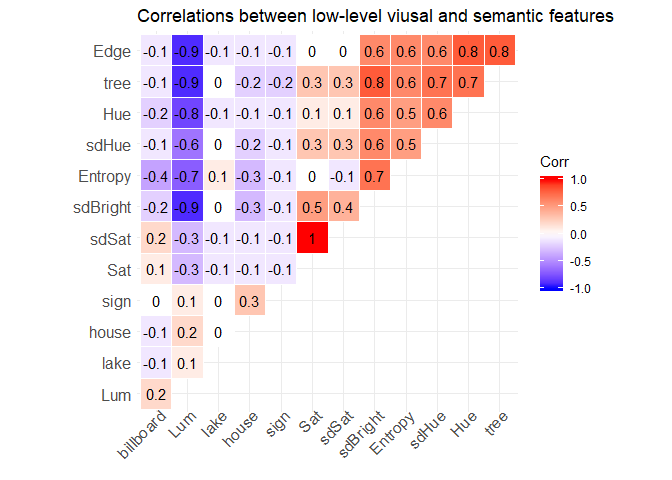

final\_proj
================
Muxuan Lyu
May 25, 2018

##### Regression analysis in videos of flat terrains

<table style="border-collapse:collapse; border:none;border-bottom:double;">
<td style="padding:0.2cm; border-top:double;">
 
</td>
<td style="border-bottom:1px solid; padding-left:0.5em; padding-right:0.5em; border-top:double;">
 
</td>
<td style="padding:0.2cm; text-align:center; border-bottom:1px solid; border-top:double;" colspan="3">
AvePref
</td>
</tr>
<tr>
<td style="padding:0.2cm; font-style:italic;">
 
</td>
<td style="padding-left:0.5em; padding-right:0.5em; font-style:italic;">
 
</td>
<td style="padding:0.2cm; text-align:center; font-style:italic; ">
B
</td>
<td style="padding:0.2cm; text-align:center; font-style:italic; ">
CI
</td>
<td style="padding:0.2cm; text-align:center; font-style:italic; ">
p
</td>
</tr>
<tr>
<td style="padding:0.2cm; border-top:1px solid; text-align:left;">
(Intercept)
</td>
<td style="padding-left:0.5em; padding-right:0.5em; border-top:1px solid; ">
 
</td>
<td style="padding:0.2cm; text-align:center; border-top:1px solid; ">
0.27
</td>
<td style="padding:0.2cm; text-align:center; border-top:1px solid; ">
0.19 – 0.36
</td>
<td style="padding:0.2cm; text-align:center; border-top:1px solid; ">
&lt;.001
</td>
</tr>
<tr>
<td style="padding:0.2cm; text-align:left;">
Edge
</td>
<td style="padding-left:0.5em; padding-right:0.5em;">
 
</td>
<td style="padding:0.2cm; text-align:center; ">
-0.12
</td>
<td style="padding:0.2cm; text-align:center; ">
-0.27 – 0.03
</td>
<td style="padding:0.2cm; text-align:center; ">
.126
</td>
</tr>
<tr>
<td style="padding:0.2cm; text-align:left;">
Hue
</td>
<td style="padding-left:0.5em; padding-right:0.5em;">
 
</td>
<td style="padding:0.2cm; text-align:center; ">
0.20
</td>
<td style="padding:0.2cm; text-align:center; ">
0.07 – 0.34
</td>
<td style="padding:0.2cm; text-align:center; ">
.003
</td>
</tr>
<tr>
<td style="padding:0.2cm; text-align:left;">
Sat
</td>
<td style="padding-left:0.5em; padding-right:0.5em;">
 
</td>
<td style="padding:0.2cm; text-align:center; ">
0.53
</td>
<td style="padding:0.2cm; text-align:center; ">
-0.13 – 1.18
</td>
<td style="padding:0.2cm; text-align:center; ">
.114
</td>
</tr>
<tr>
<td style="padding:0.2cm; text-align:left;">
Lum
</td>
<td style="padding-left:0.5em; padding-right:0.5em;">
 
</td>
<td style="padding:0.2cm; text-align:center; ">
-1.19
</td>
<td style="padding:0.2cm; text-align:center; ">
-1.82 – -0.56
</td>
<td style="padding:0.2cm; text-align:center; ">
&lt;.001
</td>
</tr>
<tr>
<td style="padding:0.2cm; text-align:left;">
sdHue
</td>
<td style="padding-left:0.5em; padding-right:0.5em;">
 
</td>
<td style="padding:0.2cm; text-align:center; ">
-0.24
</td>
<td style="padding:0.2cm; text-align:center; ">
-0.45 – -0.03
</td>
<td style="padding:0.2cm; text-align:center; ">
.023
</td>
</tr>
<tr>
<td style="padding:0.2cm; text-align:left;">
sdSat
</td>
<td style="padding-left:0.5em; padding-right:0.5em;">
 
</td>
<td style="padding:0.2cm; text-align:center; ">
-1.48
</td>
<td style="padding:0.2cm; text-align:center; ">
-2.01 – -0.96
</td>
<td style="padding:0.2cm; text-align:center; ">
&lt;.001
</td>
</tr>
<tr>
<td style="padding:0.2cm; text-align:left;">
sdBright
</td>
<td style="padding-left:0.5em; padding-right:0.5em;">
 
</td>
<td style="padding:0.2cm; text-align:center; ">
0.72
</td>
<td style="padding:0.2cm; text-align:center; ">
0.20 – 1.25
</td>
<td style="padding:0.2cm; text-align:center; ">
.007
</td>
</tr>
<tr>
<td style="padding:0.2cm; text-align:left;">
Entropy
</td>
<td style="padding-left:0.5em; padding-right:0.5em;">
 
</td>
<td style="padding:0.2cm; text-align:center; ">
-0.17
</td>
<td style="padding:0.2cm; text-align:center; ">
-0.43 – 0.10
</td>
<td style="padding:0.2cm; text-align:center; ">
.225
</td>
</tr>
<tr>
<td style="padding:0.2cm; text-align:left;">
tree\_PC1
</td>
<td style="padding-left:0.5em; padding-right:0.5em;">
 
</td>
<td style="padding:0.2cm; text-align:center; ">
-0.37
</td>
<td style="padding:0.2cm; text-align:center; ">
-0.66 – -0.09
</td>
<td style="padding:0.2cm; text-align:center; ">
.011
</td>
</tr>
<tr>
<td style="padding:0.2cm; text-align:left;">
sign
</td>
<td style="padding-left:0.5em; padding-right:0.5em;">
 
</td>
<td style="padding:0.2cm; text-align:center; ">
0.12
</td>
<td style="padding:0.2cm; text-align:center; ">
-0.34 – 0.59
</td>
<td style="padding:0.2cm; text-align:center; ">
.605
</td>
</tr>
<tr>
<td style="padding:0.2cm; text-align:left;">
house
</td>
<td style="padding-left:0.5em; padding-right:0.5em;">
 
</td>
<td style="padding:0.2cm; text-align:center; ">
0.09
</td>
<td style="padding:0.2cm; text-align:center; ">
-0.21 – 0.38
</td>
<td style="padding:0.2cm; text-align:center; ">
.558
</td>
</tr>
<tr>
<td style="padding:0.2cm; text-align:left;">
billboard
</td>
<td style="padding-left:0.5em; padding-right:0.5em;">
 
</td>
<td style="padding:0.2cm; text-align:center; ">
-1.02
</td>
<td style="padding:0.2cm; text-align:center; ">
-1.18 – -0.85
</td>
<td style="padding:0.2cm; text-align:center; ">
&lt;.001
</td>
</tr>
<tr>
<td style="padding:0.2cm; padding-top:0.1cm; padding-bottom:0.1cm; text-align:left; border-top:1px solid;">
Observations
</td>
<td style="padding-left:0.5em; padding-right:0.5em; border-top:1px solid;">
 
</td>
<td style="padding:0.2cm; padding-top:0.1cm; padding-bottom:0.1cm; text-align:center; border-top:1px solid;" colspan="3">
480
</td>
</tr>
<tr>
<td style="padding:0.2cm; text-align:left; padding-top:0.1cm; padding-bottom:0.1cm;">
R2 / adj. R2
</td>
<td style="padding-left:0.5em; padding-right:0.5em;">
 
</td>
<td style="padding:0.2cm; text-align:center; padding-top:0.1cm; padding-bottom:0.1cm;" colspan="3">
.456 / .443
</td>
</tr>
</table>
##### Visualize regression table 1

##### Regression analysis in videos of rolling hills

<table style="border-collapse:collapse; border:none;border-bottom:double;">
<td style="padding:0.2cm; border-top:double;">
 
</td>
<td style="border-bottom:1px solid; padding-left:0.5em; padding-right:0.5em; border-top:double;">
 
</td>
<td style="padding:0.2cm; text-align:center; border-bottom:1px solid; border-top:double;" colspan="3">
AvePref
</td>
</tr>
<tr>
<td style="padding:0.2cm; font-style:italic;">
 
</td>
<td style="padding-left:0.5em; padding-right:0.5em; font-style:italic;">
 
</td>
<td style="padding:0.2cm; text-align:center; font-style:italic; ">
B
</td>
<td style="padding:0.2cm; text-align:center; font-style:italic; ">
CI
</td>
<td style="padding:0.2cm; text-align:center; font-style:italic; ">
p
</td>
</tr>
<tr>
<td style="padding:0.2cm; border-top:1px solid; text-align:left;">
(Intercept)
</td>
<td style="padding-left:0.5em; padding-right:0.5em; border-top:1px solid; ">
 
</td>
<td style="padding:0.2cm; text-align:center; border-top:1px solid; ">
-0.10
</td>
<td style="padding:0.2cm; text-align:center; border-top:1px solid; ">
-0.18 – -0.02
</td>
<td style="padding:0.2cm; text-align:center; border-top:1px solid; ">
.015
</td>
</tr>
<tr>
<td style="padding:0.2cm; text-align:left;">
Edge
</td>
<td style="padding-left:0.5em; padding-right:0.5em;">
 
</td>
<td style="padding:0.2cm; text-align:center; ">
-0.09
</td>
<td style="padding:0.2cm; text-align:center; ">
-0.32 – 0.14
</td>
<td style="padding:0.2cm; text-align:center; ">
.426
</td>
</tr>
<tr>
<td style="padding:0.2cm; text-align:left;">
Hue
</td>
<td style="padding-left:0.5em; padding-right:0.5em;">
 
</td>
<td style="padding:0.2cm; text-align:center; ">
0.02
</td>
<td style="padding:0.2cm; text-align:center; ">
-0.17 – 0.22
</td>
<td style="padding:0.2cm; text-align:center; ">
.826
</td>
</tr>
<tr>
<td style="padding:0.2cm; text-align:left;">
Sat
</td>
<td style="padding-left:0.5em; padding-right:0.5em;">
 
</td>
<td style="padding:0.2cm; text-align:center; ">
2.80
</td>
<td style="padding:0.2cm; text-align:center; ">
2.11 – 3.49
</td>
<td style="padding:0.2cm; text-align:center; ">
&lt;.001
</td>
</tr>
<tr>
<td style="padding:0.2cm; text-align:left;">
Lum
</td>
<td style="padding-left:0.5em; padding-right:0.5em;">
 
</td>
<td style="padding:0.2cm; text-align:center; ">
-1.05
</td>
<td style="padding:0.2cm; text-align:center; ">
-1.54 – -0.56
</td>
<td style="padding:0.2cm; text-align:center; ">
&lt;.001
</td>
</tr>
<tr>
<td style="padding:0.2cm; text-align:left;">
sdHue
</td>
<td style="padding-left:0.5em; padding-right:0.5em;">
 
</td>
<td style="padding:0.2cm; text-align:center; ">
-0.10
</td>
<td style="padding:0.2cm; text-align:center; ">
-0.24 – 0.05
</td>
<td style="padding:0.2cm; text-align:center; ">
.209
</td>
</tr>
<tr>
<td style="padding:0.2cm; text-align:left;">
sdSat
</td>
<td style="padding-left:0.5em; padding-right:0.5em;">
 
</td>
<td style="padding:0.2cm; text-align:center; ">
-3.76
</td>
<td style="padding:0.2cm; text-align:center; ">
-4.55 – -2.98
</td>
<td style="padding:0.2cm; text-align:center; ">
&lt;.001
</td>
</tr>
<tr>
<td style="padding:0.2cm; text-align:left;">
sdBright
</td>
<td style="padding-left:0.5em; padding-right:0.5em;">
 
</td>
<td style="padding:0.2cm; text-align:center; ">
0.73
</td>
<td style="padding:0.2cm; text-align:center; ">
0.45 – 1.00
</td>
<td style="padding:0.2cm; text-align:center; ">
&lt;.001
</td>
</tr>
<tr>
<td style="padding:0.2cm; text-align:left;">
Entropy
</td>
<td style="padding-left:0.5em; padding-right:0.5em;">
 
</td>
<td style="padding:0.2cm; text-align:center; ">
0.45
</td>
<td style="padding:0.2cm; text-align:center; ">
0.24 – 0.65
</td>
<td style="padding:0.2cm; text-align:center; ">
&lt;.001
</td>
</tr>
<tr>
<td style="padding:0.2cm; text-align:left;">
tree\_PC1
</td>
<td style="padding-left:0.5em; padding-right:0.5em;">
 
</td>
<td style="padding:0.2cm; text-align:center; ">
-0.61
</td>
<td style="padding:0.2cm; text-align:center; ">
-0.96 – -0.26
</td>
<td style="padding:0.2cm; text-align:center; ">
&lt;.001
</td>
</tr>
<tr>
<td style="padding:0.2cm; text-align:left;">
sign
</td>
<td style="padding-left:0.5em; padding-right:0.5em;">
 
</td>
<td style="padding:0.2cm; text-align:center; ">
0.08
</td>
<td style="padding:0.2cm; text-align:center; ">
-0.48 – 0.64
</td>
<td style="padding:0.2cm; text-align:center; ">
.787
</td>
</tr>
<tr>
<td style="padding:0.2cm; text-align:left;">
lake
</td>
<td style="padding-left:0.5em; padding-right:0.5em;">
 
</td>
<td style="padding:0.2cm; text-align:center; ">
0.96
</td>
<td style="padding:0.2cm; text-align:center; ">
0.68 – 1.23
</td>
<td style="padding:0.2cm; text-align:center; ">
&lt;.001
</td>
</tr>
<tr>
<td style="padding:0.2cm; padding-top:0.1cm; padding-bottom:0.1cm; text-align:left; border-top:1px solid;">
Observations
</td>
<td style="padding-left:0.5em; padding-right:0.5em; border-top:1px solid;">
 
</td>
<td style="padding:0.2cm; padding-top:0.1cm; padding-bottom:0.1cm; text-align:center; border-top:1px solid;" colspan="3">
480
</td>
</tr>
<tr>
<td style="padding:0.2cm; text-align:left; padding-top:0.1cm; padding-bottom:0.1cm;">
R2 / adj. R2
</td>
<td style="padding-left:0.5em; padding-right:0.5em;">
 
</td>
<td style="padding:0.2cm; text-align:center; padding-top:0.1cm; padding-bottom:0.1cm;" colspan="3">
.340 / .325
</td>
</tr>
</table>
##### Visualize regression table 2

##### Regression analysis in videos of mountainous forests

<table style="border-collapse:collapse; border:none;border-bottom:double;">
<td style="padding:0.2cm; border-top:double;">
 
</td>
<td style="border-bottom:1px solid; padding-left:0.5em; padding-right:0.5em; border-top:double;">
 
</td>
<td style="padding:0.2cm; text-align:center; border-bottom:1px solid; border-top:double;" colspan="3">
AvePref
</td>
</tr>
<tr>
<td style="padding:0.2cm; font-style:italic;">
 
</td>
<td style="padding-left:0.5em; padding-right:0.5em; font-style:italic;">
 
</td>
<td style="padding:0.2cm; text-align:center; font-style:italic; ">
B
</td>
<td style="padding:0.2cm; text-align:center; font-style:italic; ">
CI
</td>
<td style="padding:0.2cm; text-align:center; font-style:italic; ">
p
</td>
</tr>
<tr>
<td style="padding:0.2cm; border-top:1px solid; text-align:left;">
(Intercept)
</td>
<td style="padding-left:0.5em; padding-right:0.5em; border-top:1px solid; ">
 
</td>
<td style="padding:0.2cm; text-align:center; border-top:1px solid; ">
-0.21
</td>
<td style="padding:0.2cm; text-align:center; border-top:1px solid; ">
-0.26 – -0.16
</td>
<td style="padding:0.2cm; text-align:center; border-top:1px solid; ">
&lt;.001
</td>
</tr>
<tr>
<td style="padding:0.2cm; text-align:left;">
Edge
</td>
<td style="padding-left:0.5em; padding-right:0.5em;">
 
</td>
<td style="padding:0.2cm; text-align:center; ">
-0.10
</td>
<td style="padding:0.2cm; text-align:center; ">
-0.25 – 0.04
</td>
<td style="padding:0.2cm; text-align:center; ">
.160
</td>
</tr>
<tr>
<td style="padding:0.2cm; text-align:left;">
Hue
</td>
<td style="padding-left:0.5em; padding-right:0.5em;">
 
</td>
<td style="padding:0.2cm; text-align:center; ">
-0.14
</td>
<td style="padding:0.2cm; text-align:center; ">
-0.22 – -0.07
</td>
<td style="padding:0.2cm; text-align:center; ">
&lt;.001
</td>
</tr>
<tr>
<td style="padding:0.2cm; text-align:left;">
Sat
</td>
<td style="padding-left:0.5em; padding-right:0.5em;">
 
</td>
<td style="padding:0.2cm; text-align:center; ">
-0.18
</td>
<td style="padding:0.2cm; text-align:center; ">
-0.55 – 0.19
</td>
<td style="padding:0.2cm; text-align:center; ">
.340
</td>
</tr>
<tr>
<td style="padding:0.2cm; text-align:left;">
Lum
</td>
<td style="padding-left:0.5em; padding-right:0.5em;">
 
</td>
<td style="padding:0.2cm; text-align:center; ">
-0.38
</td>
<td style="padding:0.2cm; text-align:center; ">
-0.63 – -0.12
</td>
<td style="padding:0.2cm; text-align:center; ">
.004
</td>
</tr>
<tr>
<td style="padding:0.2cm; text-align:left;">
sdHue
</td>
<td style="padding-left:0.5em; padding-right:0.5em;">
 
</td>
<td style="padding:0.2cm; text-align:center; ">
0.21
</td>
<td style="padding:0.2cm; text-align:center; ">
0.13 – 0.29
</td>
<td style="padding:0.2cm; text-align:center; ">
&lt;.001
</td>
</tr>
<tr>
<td style="padding:0.2cm; text-align:left;">
sdSat
</td>
<td style="padding-left:0.5em; padding-right:0.5em;">
 
</td>
<td style="padding:0.2cm; text-align:center; ">
-0.08
</td>
<td style="padding:0.2cm; text-align:center; ">
-0.40 – 0.25
</td>
<td style="padding:0.2cm; text-align:center; ">
.651
</td>
</tr>
<tr>
<td style="padding:0.2cm; text-align:left;">
sdBright
</td>
<td style="padding-left:0.5em; padding-right:0.5em;">
 
</td>
<td style="padding:0.2cm; text-align:center; ">
-0.05
</td>
<td style="padding:0.2cm; text-align:center; ">
-0.21 – 0.10
</td>
<td style="padding:0.2cm; text-align:center; ">
.508
</td>
</tr>
<tr>
<td style="padding:0.2cm; text-align:left;">
Entropy
</td>
<td style="padding-left:0.5em; padding-right:0.5em;">
 
</td>
<td style="padding:0.2cm; text-align:center; ">
-0.03
</td>
<td style="padding:0.2cm; text-align:center; ">
-0.11 – 0.04
</td>
<td style="padding:0.2cm; text-align:center; ">
.379
</td>
</tr>
<tr>
<td style="padding:0.2cm; text-align:left;">
tree\_PC1
</td>
<td style="padding-left:0.5em; padding-right:0.5em;">
 
</td>
<td style="padding:0.2cm; text-align:center; ">
0.17
</td>
<td style="padding:0.2cm; text-align:center; ">
0.06 – 0.29
</td>
<td style="padding:0.2cm; text-align:center; ">
.004
</td>
</tr>
<tr>
<td style="padding:0.2cm; text-align:left;">
lake
</td>
<td style="padding-left:0.5em; padding-right:0.5em;">
 
</td>
<td style="padding:0.2cm; text-align:center; ">
2.80
</td>
<td style="padding:0.2cm; text-align:center; ">
2.58 – 3.01
</td>
<td style="padding:0.2cm; text-align:center; ">
&lt;.001
</td>
</tr>
<tr>
<td style="padding:0.2cm; padding-top:0.1cm; padding-bottom:0.1cm; text-align:left; border-top:1px solid;">
Observations
</td>
<td style="padding-left:0.5em; padding-right:0.5em; border-top:1px solid;">
 
</td>
<td style="padding:0.2cm; padding-top:0.1cm; padding-bottom:0.1cm; text-align:center; border-top:1px solid;" colspan="3">
468
</td>
</tr>
<tr>
<td style="padding:0.2cm; text-align:left; padding-top:0.1cm; padding-bottom:0.1cm;">
R2 / adj. R2
</td>
<td style="padding-left:0.5em; padding-right:0.5em;">
 
</td>
<td style="padding:0.2cm; text-align:center; padding-top:0.1cm; padding-bottom:0.1cm;" colspan="3">
.689 / .683
</td>
</tr>
</table>
##### Visualize regression table 3

